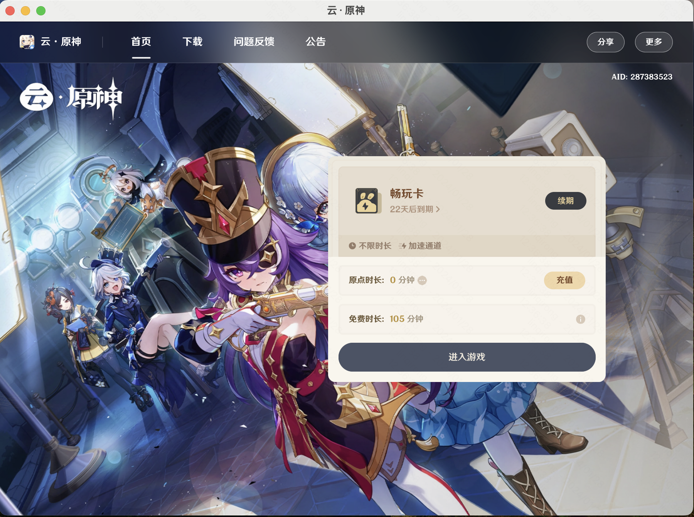

# 原神云游戏桌面客户端

基于 Electron + TypeScript 开发的原神云游戏桌面客户端应用。

🔗[下载链接](https://github.com/qirong77/genshin_clound/releases/download/1.0/genshi_clound-1.0.0.dmg)



## 技术栈

- Electron 20.3.1
- TypeScript
- Electron Vite
- ESLint + Prettier

## 项目结构

```
├── src/                    # 源代码目录
│   ├── main/              # 主进程代码
│   ├── preload/           # 预加载脚本
│   └── renderer/          # 渲染进程代码
├── electron.vite.config.ts # Electron Vite 配置
└── package.json           # 项目配置文件
```

## 开发环境配置

### 前置要求

- Node.js
- npm/yarn

### 安装依赖

```bash
npm install
```

### 开发调试

```bash
npm run dev
```

### 代码格式化

```bash
npm run format
```

### 类型检查

```bash
npm run typecheck
```

## 构建部署

### Windows

```bash
npm run build:win
```

### macOS

```bash
npm run build:mac
```

### Linux

```bash
npm run build:linux
```

## 许可证

本项目基于 MIT 许可证开源。